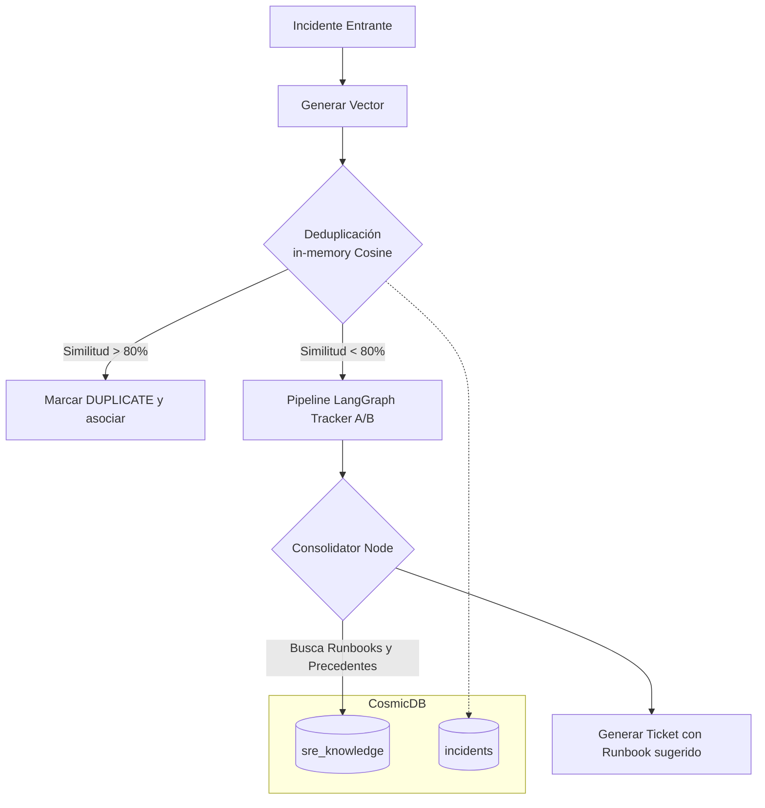

# SRE Agent — Knowledge Flywheel Architecture

## Resumen del Sistema

El **Knowledge Flywheel** es el componente de memoria a largo plazo y mejora continua del SRE Agent. Transforma al agente de una simple herramienta de "búsqueda en código" a un ingeniero SRE autónomo capaz de aprender de incidentes pasados, detectar patrones recurrentes y sugerir manuales operativos (Runbooks).

Este diseño sigue el patrón de "Mejora Continua Automatizada":
1. **Opera:** Resuelve un incidente.
2. **Escribe y Audita:** Registra todos los pasos y conclusiones en un Ledger inmutable.
3. **Indexa:** Transforma la resolución en "Chunks de Conocimiento" semántico.
4. **Retroalimenta:** Utiliza la base de conocimiento para el siguiente incidente.

## Arquitectura de Contenedores y Datos

Para mantener la precisión y no diluir los vectores de código con los vectores operativos, la arquitectura separa la base de conocimiento en contenedores de **Azure Cosmos DB NoSQL**:

*   **`eshop_chunks`:** (Estático/Semi-estático) Contiene los fragmentos AST del código fuente de los microservicios.
*   **`sre_knowledge`:** (Dinámico) El "Cerebro Operativo". Contiene:
    *   **Historial de Incidentes:** Chunks divididos ontológicamente en `SYMPTOM` (cómo se presentó), `ROOT_CAUSE` (por qué pasó) y `RESOLUTION` (cómo se arregló).
    *   **Runbooks:** Guías operativas paso a paso ingestadas directamente por los equipos (`doc_type: RUNBOOK`).
*   **`incidents`:** El estado transaccional actual de cada incidente abierto, incluyendo su `report_embedding` nativo.

## Pipeline de Deduplicación e Ingesta (El Escudo)

Antes de invocar el pipeline de LangGraph (que consume tokens y llamadas de recuperación pesadas de código), el sistema ejecuta un chequeo de deduplicación.

1. Se genera un `report_embedding` con Gemini sobre el reporte inicial.
2. En lugar de hacer una búsqueda pesada por el index Vector DiskANN, se traen a memoria los embeddings de **sólo los incidentes abiertos** (status != RESOLVED/DUPLICATE).
3. Se aplica un **in-memory Cosine Similarity**. Si el `similarity_score` > `0.80`, se aborta el triage y el incidente se marca como `DUPLICATE`, sumando al contador (`occurrence_count`) del incidente original.

## Triage Contextual (Recuperación de Runbooks)

Cuando un incidente avanza por el pipeline y llega al nodo final validado (`consolidator`), el agente busca precedentes operativos y "Playbooks".

Para **evitar Rate Limits (HTTP 429)** al interactuar con el LLM de Embeddings, el sistema inyecta el `report_embedding` original en el estado global de LangGraph (`GraphState`). 

El consolidator realiza una búsqueda sobre `sre_knowledge` filtrando por `RUNBOOK`. Los runbooks sugeridos son adjuntados al contexto heurístico y vinculados directamente al Ticket final generado.

## Diagrama del Flujo

