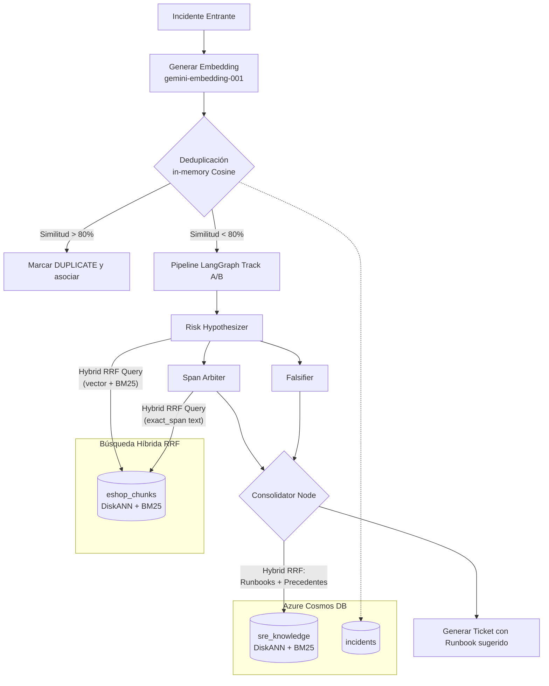

# SRE Agent — Knowledge Flywheel Architecture

## Resumen del Sistema

El **Knowledge Flywheel** es el componente de memoria a largo plazo y mejora continua del SRE Agent. Transforma al agente de una simple herramienta de "búsqueda en código" a un ingeniero SRE autónomo capaz de aprender de incidentes pasados, detectar patrones recurrentes y sugerir manuales operativos (Runbooks).

Este diseño sigue el patrón de "Mejora Continua Automatizada":
1. **Opera:** Resuelve un incidente.
2. **Escribe y Audita:** Registra todos los pasos y conclusiones en un Ledger inmutable.
3. **Indexa:** Transforma la resolución en "Chunks de Conocimiento" semántico.
4. **Retroalimenta:** Utiliza la base de conocimiento para el siguiente incidente.

## Arquitectura de Contenedores y Datos

Para mantener la precisión y no diluir los vectores de código con los vectores operativos, la arquitectura separa la base de conocimiento en contenedores de **Azure Cosmos DB NoSQL**:

*   **`eshop_chunks`:** (Estático/Semi-estático) Contiene los fragmentos AST del código fuente de los microservicios.
*   **`sre_knowledge`:** (Dinámico) El "Cerebro Operativo". Contiene:
    *   **Historial de Incidentes:** Chunks divididos ontológicamente en `SYMPTOM` (cómo se presentó), `ROOT_CAUSE` (por qué pasó) y `RESOLUTION` (cómo se arregló).
    *   **Runbooks:** Guías operativas paso a paso ingestadas directamente por los equipos (`doc_type: RUNBOOK`).
*   **`incidents`:** El estado transaccional actual de cada incidente abierto, incluyendo su `report_embedding` nativo.

### Índices por Contenedor

Ambos contenedores vectoriales (`eshop_chunks` y `sre_knowledge`) tienen habilitados:

| Índice | Tipo | Campo | Propósito |
|--------|------|-------|-----------|
| DiskANN Vector Index | `vectorIndexes` | `/embedding` | Búsqueda semántica (embeddings de `gemini-embedding-001`) |
| Full-Text Index (BM25) | `fullTextIndexes` | `/chunk_text` | Búsqueda por keywords exactos (nombres de clases, métodos, errores) |
| FullTextPolicy | `fullTextPolicy` | `/chunk_text` | Idioma `en-US` para tokenización BM25 |

La combinación de ambos índices habilita **Búsqueda Híbrida RRF** (Reciprocal Rank Fusion), donde Cosmos DB fusiona los rankings de DiskANN y BM25 en una sola lista ordenada, todo _in-database_ sin lógica de aplicación adicional.

> **Referencia:** [ADR-004: Hybrid Search using RRF](../decisions/ADR-004-hybrid-search-rrf.md)

## Pipeline de Búsqueda Híbrida (RRF)

Cuando un nodo del pipeline necesita consultar el conocimiento indexado, el flujo es:

1. El nodo genera un **embedding** del query (para DiskANN) y pasa el **texto original** (para BM25).
2. `db_provider.py` ejecuta una consulta `ORDER BY RANK RRF(VectorDistance(...), FullTextScore(...))`.
3. Cosmos DB calcula ambos scores en paralelo y los fusiona usando RRF.
4. Si la consulta híbrida falla (ej. feature flag no habilitado), el sistema hace **fallback automático** a búsqueda vectorial pura.

### ¿Por qué RRF?

| Tipo de Query | Solo Vector | Solo BM25 | Híbrido RRF |
|---|---|---|---|
| "código que maneja autenticación" | ✅ Excelente | ❌ Malo | ✅ Excelente |
| "NullReferenceException OrderItems" | ⚠️ Regular | ✅ Excelente | ✅ Excelente |
| "BasketService gRPC timeout handling" | ✅ Bueno | ✅ Bueno | ✅ **Mejor** |

El valor diferencial se manifiesta en queries con **identificadores exactos** (nombres de clases, errores, IDs de correlación) donde BM25 captura coincidencias literales que los embeddings "suavizan".

## Pipeline de Deduplicación e Ingesta (El Escudo)

Antes de invocar el pipeline de LangGraph (que consume tokens y llamadas de recuperación pesadas de código), el sistema ejecuta un chequeo de deduplicación.

1. Se genera un `report_embedding` con Gemini sobre el reporte inicial.
2. En lugar de hacer una búsqueda pesada por el index Vector DiskANN, se traen a memoria los embeddings de **sólo los incidentes abiertos** (status != RESOLVED/DUPLICATE).
3. Se aplica un **in-memory Cosine Similarity**. Si el `similarity_score` > `0.80`, se aborta el triage y el incidente se marca como `DUPLICATE`, sumando al contador (`occurrence_count`) del incidente original.

## Triage Contextual (Recuperación de Runbooks)

Cuando un incidente avanza por el pipeline y llega al nodo final validado (`consolidator`), el agente busca precedentes operativos y "Playbooks".

Para **evitar Rate Limits (HTTP 429)** al interactuar con el LLM de Embeddings, el sistema inyecta el `report_embedding` original en el estado global de LangGraph (`GraphState`). 

El consolidator realiza una **búsqueda híbrida RRF** sobre `sre_knowledge` filtrando por `RUNBOOK`. Los runbooks sugeridos son adjuntados al contexto heurístico y vinculados directamente al Ticket final generado.

## Diagrama del Flujo



## Procedimiento de Reindexación

Cuando cambia el **modelo de embeddings** o la **lógica de chunking AST**, es necesario reindexar:

```bash
# 1. Limpiar ambos contenedores vectoriales
PYTHONPATH=. python3 reset_cosmos.py

# 2. Reindexar el código fuente
curl -X POST http://localhost:8000/index?force=true

# 3. Resembrar el knowledge base
curl -X POST http://localhost:8000/knowledge/seed
```

> **⚠️ Importante:** Nunca mezclar embeddings de modelos diferentes en el mismo contenedor. El script `reset_cosmos.py` limpia tanto `eshop_chunks` como `sre_knowledge` para garantizar coherencia dimensional.
