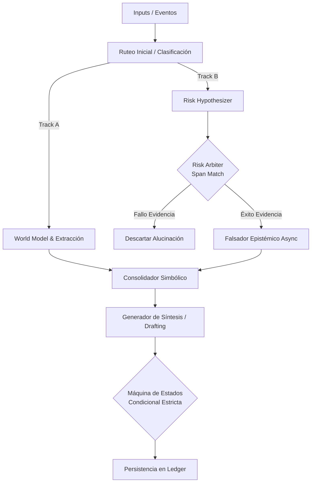

# Patrón de Arquitectura: IA Neuro-Simbólica (Dual-Track Pipeline)

Esta guía documenta el patrón arquitectónico "Dual-Track" utilizado para construir sistemas de inteligencia artificial robustos, que combinan el razonamiento probabilístico de los Modelos de Lenguaje Grandes (LLMs) con validaciones lógicas y deterministas basadas en reglas (simbólicas). 

Este enfoque está diseñado para mitigar drásticamente las alucinaciones, garantizar el estricto cumplimiento normativo e inyectar trazabilidad auditable en cada decisión tomada por el agente.

---

## 1. Concepto Central: El Pipeline de Doble Vía (Dual-Track)

Las arquitecturas puramente basadas en LLMs o en ciclos iterativos abiertos (como el ReAct genérico) sufren de inestabilidad, lentitud y propensión a la alucinación cuando se enfrentan a reglas de negocio estrictas. La arquitectura neuro-simbólica soluciona esto dividiendo el flujo de trabajo en dos pistas que se bifurcan y luego convergen:

*   **Pista A (Neuronal / Probabilística):** Encargada de la comprensión semántica, generación de hipótesis sobre datos no estructurados, extracción de entidades y simulación de escenarios (el *World Model*). Está motorizada por LLMs.
*   **Pista B (Simbólica / Determinista):** Encargada de la verificación lógica, el cálculo numérico infalible, el cumplimiento de reglas de negocio en una Máquina de Estados (FSM) y, fundamentalmente, el **anclaje de la evidencia**. Utiliza código tradicional (Python/TypeScript), consultas directas a bases de datos y motores puramente lógicos.

---

## 2. Componentes Clave del Sistema

El patrón se implementa estructurando el código en los siguientes nódulos arquitectónicos:

### 2.1 Modelo Cognitivo Espacial (World Model)
*   **Propósito:** Actúa como el ancla cognitiva de todo el sistema. No resuelve el problema del usuario de golpe, sino que usa el LLM para "imaginar" o simular el estado integral basándose en la información de entrada (ej. un correo electrónico).
*   **Implementación:** Un LLM procesa la entrada no estructurada y proyecta un estado en múltiples dimensiones de negocio (por ejemplo: dimensiones operativas, temporales, de producto y compliance).
*   **Axioma de Diseño:** La salida debe ser una estructura de datos estricta (Pydantic/JSON Schema) que clasifique no solo los *hechos explícitos*, sino también las *inferencias* y los *huecos de información (unknowns)*.

### 2.2 Extractor de Entidades (Slot Filling)
*   **Propósito:** Extraer la data requerida explícita para que el proceso avance.
*   **Capa Neuronal:** El LLM mapea texto libre a una taxonomía predefinida estructurada.
*   **Capa Simbólica:** El código receptor intercepta el JSON y verifica tipos de datos, cruza contra catálogos internos referenciales y levanta banderas rojas en validaciones fallidas.

### 2.3 Generador de Hipótesis de Riesgo (Risk Hypothesizer) - *Track B*
*   **Propósito:** Un LLM instruido explícitamente para actuar de manera "paranoica", buscando activamente riesgos, inconsistencias lógicas o violaciones operativas implícitas en la información proporcionada.
*   **Restricción Estricta:** El LLM **DEBE** citar textualmente la parte exacta del documento (un "Span" de texto) que le induce a generar esa hipótesis.
*   **Salida:** Lista de `[Hipótesis + Cita Corta Exacta]`.

### 2.4 Árbitro Determinista (Span Verification) - *Track B*
*   **Propósito:** Es la primera barrera Anti-Alucinaciones. Actúa de forma **100% simbólica**.
*   **Lógica:** Un script de Python toma la "Cita Corta Exacta" generada por el LLM en el paso 2.3 y realiza una búsqueda de texto estricta (ej. `difflib.SequenceMatcher` o búsqueda de subcadena exacta) contra el documento original crudo.
*   **Resolución:** Si el Árbitro no logra encontrar la cita en el texto origen, asume de inmediato que el LLM ha alucinado la evidencia. La hipótesis de riesgo se descarta silente y completamente (Falsación Nivel 1).

### 2.5 El Falsador Epistémico (El Adversario o Variante J)
*   **Propósito:** Desafiar las hipótesis sobrevivientes y validadas por el Árbitro mediante comprobaciones contra conocimiento del mundo real.
*   **Implementación ("Variante J"):** En lugar de un cuello de botella sincrónico, se levantan funciones asíncronas (`async fan-out`) por cada riesgo detectado. Cada función puede invocar herramientas deterministas locales (consultas en BD, vectores internos) o herramientas externas de Grounding (búsquedas en internet via Perplexity o Google Grounding tools).
*   **Axiomas de Falsación:** Cada hipótesis es sometida a principios epistémicos fijos, como *Factibilidad Física* (ej. "el puerto está cerrado"), *Integridad Documental*, o *Consistencia Normativa*.

### 2.6 Motor de Consolidación de Átomos y Estado FSM
*   **Propósito:** Agrupar todos los hallazgos en "Átomos" de decisión y orquestar el movimiento a través de los estados del proceso.
*   **Implementación Simbólica Pura:** Se define una Entidad Máquina de Estados (Entity-State Machine). El caso *solamente* avanza (ej. de `INCOMPLETE` a `READY`) si condiciones algebraicas exactas se cumplen (ej. `missing_variables == 0` AND `unresolved_risks == 0`). 
*   **Anti-Patrón a evitar:** NUNCA permitas que un LLM decida directamente cuál es el estado general del macro-proceso.

### 2.7 El Libro Mayor Explícito (The Ledger)
*   **Propósito:** Almacenamiento inmutable para trazabilidad y justificación de decisiones.
*   **Implementación:** Una base de datos relacional (o persistencia estructurada SQlite/Postgres) que registra de forma inmutable cada hipótesis propuesta, el resultado del Árbitro de Citas, el veredicto epistémico del Falsador y todas las transiciones del estado lógico de la FSM.

---

## 3. Topología e Infraestructura (El Patrón LangGraph)

Para implementar esto fluidamente, el patrón se apoya altamente en grafos temporales conscientes del estado (como **LangGraph**), modelando la ejecución como:

### Reglas Clave en el Grafo
1.  **Nodos Puros:** Funciones que ejecutan cálculos matemáticos o validación Pydantic sin invocar LLMs. Son la columna vertebral.
2.  **Nodos Mixtos:** Prompts que devuelven salidas forzadas por Pydantic Schema.
3.  **Aristas Condicionales:** Enrrutamientos condicionales que se basan en banderas booleanas del Ledger, nunca preguntándole de nuevo al LLM adonde ir.

---

## 4. Mejores Prácticas (Lessons Learned: Proyecto FreightOS)

Al llevarte este patrón a otro proyecto, considera estas lecciones críticas derivadas de escalar sistemas neurosimbólicos en producción:

### A. La Trampa de la Carpeta de Herramientas (Tool Calling)
*   **El Problema:** Darle a un modelo grande una tarea compleja de estructuración JSON (un output schema complejo) junto con una gran cantidad de `tools` disponibles suele provocar que el LLM colapse en loops ReAct infinitos o ignore las herramientas.
*   **La Solución:** Usa **Single-Shot con Native Schema Required** (`with_structured_output(strict=True)`). Permite que el modelo fundamente la respuesta *under-the-hood* primero, y sólo entregue el JSON final con los datos ya embebidos, en lugar de ponerlo a jugar a iterar.

### B. Segregación de Responsabilidades (Auditor vs. Investigador)
No puedes tener un solo prompt que encuentre riesgos y los investigue al mismo tiempo sin paralizar la aplicación y disparar tus falsos positivos:
*   **Rol 1 (Auditor):** El `Risk Hypothesizer` o "World Model". Usa single-shot, tiene alta cobertura (encuentra todo) y es muy rápido. 
*   **Rol 2 (Investigador):** El `Epistemic Falsifier` que corre en *Async Parallel*. Solo él usa llamadas ReAct que iteran herramientas. Se lanzan múltiples mini-agentes investigadores en paralelo (uno por cada riesgo que superó el Arbitraje), lo cual no frena el tiempo de respuesta total del sistema.

### C. Abstracción del Proveedor Neuronal
Coloca siempre una fachada central (factory service) para todas las invocaciones a los modelos (ej. un `chains/llm_provider.py`). Esto te permitirá saltar libremente entre modelos de OpenAI, Google Gemini o endpoints de Azure en tiempo de ejecución de acuerdo a los costos o la latencia per-nodo, y te facilita centralizar la inyección de telemetría (para medir tokens y métricas de caché globalmente).
