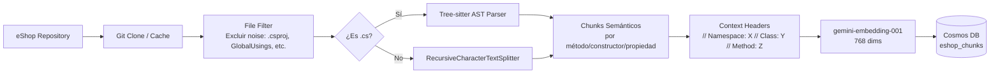
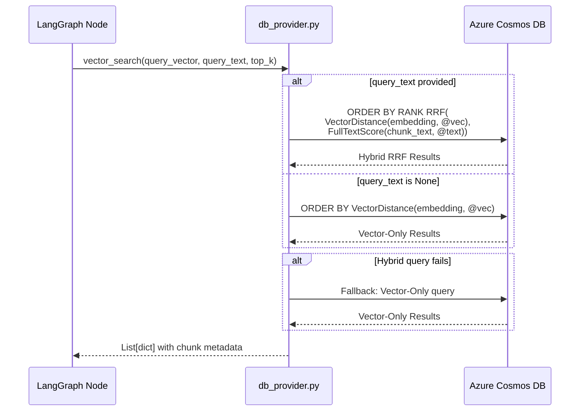

# SRE Agent — Retrieval Pipeline Architecture

## Visión General

El Retrieval Pipeline es el componente que conecta al agente SRE con su fuente de verdad: el código fuente indexado y el conocimiento operativo acumulado. Implementa una arquitectura de **Búsqueda Híbrida** sobre Azure Cosmos DB NoSQL, combinando similitud vectorial (DiskANN) con coincidencia por keywords (BM25) mediante **Reciprocal Rank Fusion (RRF)**.

## Stack Tecnológico

| Componente | Tecnología | Rol |
|---|---|---|
| Embedding Model | `gemini-embedding-001` | Genera vectores de 768 dimensiones |
| Vector Index | Azure Cosmos DB DiskANN | Búsqueda por similitud semántica |
| Full-Text Index | Azure Cosmos DB BM25 | Búsqueda por keywords exactos |
| Fusión de Rankings | Cosmos DB RRF nativo | Combina resultados in-database |
| Chunking Strategy | Tree-sitter AST (C#) | Genera fragmentos semánticos a nivel de método/clase |
| Fallback Chunking | `RecursiveCharacterTextSplitter` | Para archivos no-C# |

## Flujo de Indexación



### Metadatos por Chunk

Cada chunk indexado contiene:

```json
{
  "id": "hash_unico",
  "file_path": "src/Ordering.API/Controllers/OrdersController.cs",
  "service_name": "Ordering.API",
  "chunk_text": "// Namespace: Ordering.API.Controllers\n// Class: OrdersController\n...",
  "start_line": 45,
  "end_line": 78,
  "language": "csharp",
  "class_name": "OrdersController",
  "method_name": "CreateOrder",
  "chunk_type": "method_declaration",
  "embedding": [0.012, -0.034, ...]
}
```

## Flujo de Búsqueda (Query Time)



## Nodos Consumidores y sus Estrategias de Query

| Nodo | Container | query_text | Estrategia |
|---|---|---|---|
| `risk_hypothesizer` | `eshop_chunks` | Expanded queries (4 perspectivas) | Multi-query expansion: genera 4 queries diferentes (error, service, pattern, dependency) y deduplica resultados |
| `risk_hypothesizer` | `sre_knowledge` | Primary query del incidente | Busca precedentes históricos para detectar patrones recurrentes |
| `span_arbiter` | `eshop_chunks` | `exact_span` literal | BM25 brilla aquí: el span contiene identificadores exactos del código |
| `consolidator` | `sre_knowledge` | Runbook query construido | Busca runbooks operativos que matcheen con el servicio afectado |

### Query Expansion (risk_hypothesizer)

El hypothesizer genera 4 queries diferentes por incidente:

```
error_query:      "NullReferenceException OrderItems Handle method"
service_query:    "Ordering.API OrdersController CreateOrder endpoint"
pattern_query:    "null check missing collection iteration LINQ"
dependency_query: "OrderItems DI registration MediatoR handler"
```

Cada query genera un embedding y se ejecuta como búsqueda híbrida independiente. Los resultados se deduplicaban por `chunk_id`.

## Mecanismo de Fallback

El sistema implementa un fallback de 3 niveles para garantizar disponibilidad:

1. **Hybrid RRF** (DiskANN + BM25) — intento principal
2. **Vector-Only** (DiskANN) — si RRF falla (feature no habilitado, error de query)
3. **Error gracioso** — log + la pipeline continúa sin resultados de retrieval

```python
def vector_search(query_vector, *, query_text=None, top_k=5):
    if query_text:
        try:
            return _hybrid_search_chunks(container, query_vector, query_text, top_k)
        except Exception:
            logger.warning("Hybrid failed, falling back to vector-only")
    return _vector_only_search_chunks(container, query_vector, top_k)
```

## Estadísticas del Índice Actual

| Métrica | Valor |
|---|---|
| Archivos procesados | 573 |
| Chunks en `eshop_chunks` | 1,395 |
| Chunks en `sre_knowledge` | 22 |
| Embedding model | `gemini-embedding-001` |
| Dimensiones del vector | 768 |
| Partition Key | `/service_name` |

## ADRs Relacionados

| ADR | Decisión |
|---|---|
| [ADR-001](../decisions/ADR-001-ast-code-chunking.md) | AST-Based Code Chunking con Tree-sitter |
| [ADR-002](../decisions/ADR-002-cosmosdb-over-chroma.md) | Cosmos DB sobre Chroma DB |
| [ADR-004](../decisions/ADR-004-hybrid-search-rrf.md) | Hybrid Search con RRF (DiskANN + BM25) |
